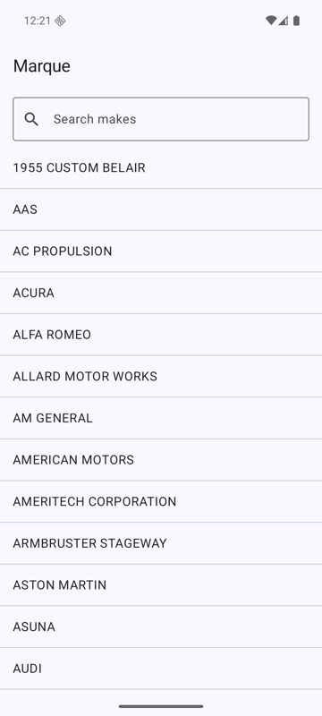
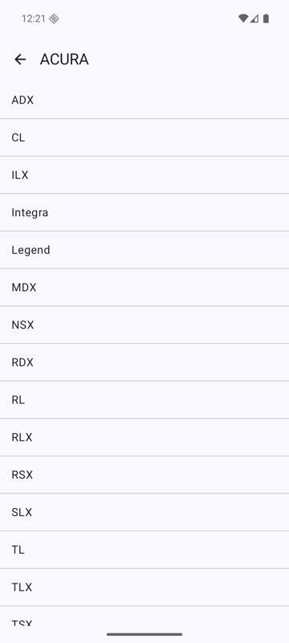
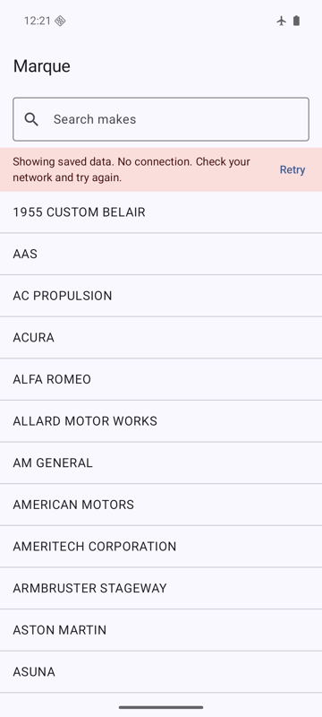
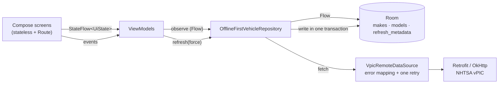

# Marque

[](https://github.com/arda-ulas/marque/actions/workflows/ci.yml)

An offline-first Android app for browsing car makes and their models, backed by the public
[NHTSA vPIC API](https://vpic.nhtsa.dot.gov/api/). Browse once online, then the list keeps
working without a connection.

**Kotlin · Jetpack Compose · Material 3 · Hilt · Retrofit + OkHttp + kotlinx.serialization ·
Room · Coroutines and Flow · Navigation Compose**

[Download the signed APK](https://github.com/arda-ulas/marque/releases/latest) · minSdk 26

<p>
  
  
  
</p>

## Architecture



Reads and refreshes are separate paths. Screens only ever render what is in the database; a
refresh pulls from the network, writes the database, and returns either success or a typed
`DataError`. It never returns data.

```
core/result   Result<D, E>, DataError
data/remote   VpicApi, DTOs, VpicRemoteDataSource, RetryPolicy
data/local    MarqueDatabase, DAOs, entities, RoomVehicleLocalDataSource
data/repository  VehicleRepository, OfflineFirstVehicleRepository
di            Hilt modules
domain/model  Make, Model
ui            makes/, models/, navigation/, common/ (shared list parts, error messages), theme/
```

## Three decisions

**1. The database is the single source of truth.** ViewModels observe Room `Flow`s from the
DAO, through the repository, into `stateIn(viewModelScope, WhileSubscribed(5_000))`. The
network only refreshes that cache. A failed refresh writes nothing, so cached data stays on
screen with a "Showing saved data" banner instead of being replaced by an error screen. The
full-screen error appears only when there is nothing cached.
*Trade-off:* the user can see stale data. The alternative, network-first with a cache
fallback, gives fresher reads but a blank screen on every slow connection, which is the worse
failure for reference data that rarely changes.

**2. Failures are mapped once, and only transient ones are retried.** `VpicRemoteDataSource`
turns exceptions into `DataError`: `HttpException` → `Http(code)`, socket timeouts →
`Timeout`, other `IOException`s → `Network`, `SerializationException` → `Serialization`.
`CancellationException` is always rethrown. Nothing above that layer catches exceptions.
`RetryPolicy` retries once, after one second, for `Network`, `Timeout`, and HTTP 5xx. A 4xx or
a malformed body fails the same way twice, so retrying it only adds latency. OkHttp timeouts:
connect 10 s, read 15 s, whole call 30 s.

**3. The cache has an explicit freshness policy.** Each refreshed resource (the makes list,
each make's models) records when it was last refreshed, written in the same transaction as the
rows. Opening a screen refreshes only if that timestamp is older than 24 hours; pull-to-refresh
and Retry always go to the network. The consequence is deliberate: with a fresh cache and no
connection, the app shows the cached list and no error, because it had no reason to make a
request.

## Surviving rotation and process death

- The selected make is a type-safe navigation argument (`ModelsRoute(makeId)`). Navigation
  keeps it in the destination's `SavedStateHandle`, so it survives process death. A small Hilt
  module decodes it there and hands `ModelsViewModel` a plain `ModelsRoute`, which keeps
  the ViewModel's unit tests on the JVM.
- The search query lives in `SavedStateHandle`.
- List scroll position uses `rememberLazyListState`, which is saveable.
- Verified on an emulator with "Don't keep activities" and `adb shell am kill` while the app
  was in the background.

## Tests

| Layer | What it proves | Where |
|---|---|---|
| Remote data source | Real Retrofit + JSON config against MockWebServer: 200 parses, 500 is retried once, 404 is not, malformed JSON → `Serialization`, stalled response → `Timeout` | JVM |
| RetryPolicy | Retries only transient errors, on virtual time | JVM |
| Repository | Refresh writes the cache; failure keeps it; fresh cache skips the network unless forced | JVM, fakes |
| ViewModels | Loading / content / content-with-error / error / empty; filtering; saved query; init doesn't force, Retry does | JVM, fake repository |
| Room DAOs | Flow emits after replace transactions; one make's models don't touch another's | Instrumented, in-memory DB |
| Compose UI | Rows render and click through; error state Retry; cached rows with the error banner | Instrumented |

41 JVM tests and 9 instrumented tests. The instrumented tests ran on an API 36 emulator.

```bash
./gradlew ktlintCheck testDebugUnitTest      # JVM tests + lint (also run in CI)
./gradlew connectedDebugAndroidTest          # needs a running emulator or device
```

## Build and release

- CI (`ci.yml`) runs ktlint, unit tests, and a debug build on every pull request and push to
  `main`.
- Pushing a `v*` tag runs `release.yml`: it decodes the keystore from repository secrets, builds
  `assembleRelease`, checks the signature with `apksigner verify`, and attaches the APK to a
  GitHub Release. Without the signing environment variables, release builds are simply
  unsigned; no keystore or password is in the repository.
- `versionCode` increases with every release, because Android refuses to install an update with
  a lower one.

Run locally: open in Android Studio (JDK 21), or `./gradlew installDebug` with a device
connected.

## Deliberately not built

- **Background sync (WorkManager).** Refresh happens when a screen opens or the user asks.
- **Paging.** About 200 makes and at most a few hundred models per make fit comfortably in memory.
- **Room migrations.** The schema is exported (`app/schemas/`) but is still at version 1.
- **Instrumented tests in CI.** Emulator runs on hosted runners are slow and flaky; they run
  locally instead.
- **Baseline Profiles, Macrobenchmark, R8 shrinking.** No performance problem has been measured
  that would justify them.
- **Play Store distribution.** Releases are GitHub Releases only.
- **Images.** The API has none.
- **Multiple Gradle modules.** One `:app` module with package boundaries is enough at this size.
- **Latest AndroidX.** compileSdk is 36; several newest AndroidX and OkHttp releases require
  compileSdk 37, so each is pinned to its newest version that supports 36.

Data: NHTSA Product Information Catalog and Vehicle Listing (vPIC), a U.S. Department of
Transportation public API. Marque is not affiliated with NHTSA.
